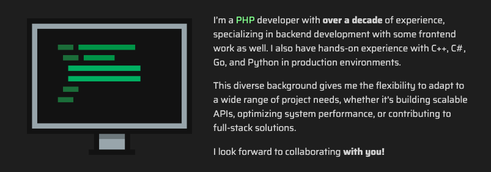

#  Tutorial 9 – ArticleText

## Preview



The `ArticleText` component is used to display blocks of text with optional images aligned to the side. It’s perfect for writing more detailed content, such as an introduction, a mission statement, or storytelling sections in your resume or portfolio.

## Basic Working Example

Just copy and paste this into a section's `articles` array and see the magic happen:

```json
{
    "id": 1,
    "component": "ArticleText",
    "locales": {
        "en": {"title": "{{A little bit}} about me..."}
    },
    "settings": {
        "order_items_by": "id",
        "order_items_sort": "asc"
    },
    "items": [
        {
            "id": 1,
            "img": "",
            "faIcon": "fa-solid fa-comments",
            "faIconColors": {"bg": "", "fill": "", "fillLight": ""},
            "locales": {
                "en": {
                    "text": "<p>This is a text! It can contain [[HTML]] tags, such as <em>italic</em>, <u>underline</u>, and even {{custom styles}}.</p><p>Feel free to modify it as you wish! :)</p>"
                }
            }
        }
    ]
}
```

### Required Settings

| Property                                 | Type    | Description                                                                           |
|------------------------------------------|---------|---------------------------------------------------------------------------------------|
| `order_items_by`                         | STRING  | Defines the item key that will be used for ordering items. Default: `"id"`.           |
| `order_items_sort`                       | STRING  | Defines the direction of the order. Use `"asc"` (ascending) or `"desc"` (descending). |

## Item Structure

Each item of the `ArticleText` article represents a block of text that can have either an image or and icon by its side.

### Empty Item Model
```json
{
    "id": 0,
    "img": "",
    "faIcon": "",
    "faIconColors": {"bg": "", "fill": "", "fillLight": ""},
    "locales": {
        "en": {
            "text": ""
        }
    }
}
```

### ⚡ Item Static Fields

| Property           | Type                 | Required?     | Description                                                                                                                                                                                       |
|--------------------|----------------------|---------------|---------------------------------------------------------------------------------------------------------------------------------------------------------------------------------------------------|
| `id`               | NUMBER               | REQUIRED      | A unique ID for the item within the article.                                                                                                                                                      |
| `img`              | STRING (URL)         | RECOMMENDED   | Path to the image shown next to the text. Must be relative to `public/`. If not provided, the article falls back to the `faIcon`. Recommended size: 800px x 660px.                                |
| `faIcon`           | STRING               | OPTIONAL      | A [Font Awesome](https://fontawesome.com/search?ic=free) icon used as a fallback if no image is specified (now supporting [PrimeIcons](https://www.primefaces.org/diamond/icons.xhtml) as well!)  |
| `faIcon.bg`        | STRING (HEX COLOR)   | OPTIONAL      | Custom background color for the `faIcon`. Defaults to transparent.                                                                                                                                |
| `faIcon.fill`      | STRING (HEX COLOR)   | OPTIONAL      | Custom `faIcon` fill color for dark themes. Defaults to the current theme's text color.                                                                                                           |
| `faIcon.fillLight` | STRING (HEX COLOR)   | OPTIONAL      | Custom `faIcon` fill color for light themes. Defaults to the current theme's text color.                                                                                                          |


### 🌐 Item Locales Fields

| Property | Type   | Required?    | Description                                                               |
|----------|--------|--------------|---------------------------------------------------------------------------|
| `text`   | STRING | RECOMMENDED  | The text that will be shown. You can use HTML tags and custom formatting. |

> **Note:** All fields in the locales object support the following custom formatting:
>- `{{Some text...}}` for highlighting a text.
>- `[[Some text...]]` for making a text bold.
>
> **Note 2:** Required and recommended fields must be present **at least** in the default language.

## Next Steps
Ready to keep going? Check out the next tutorial or revisit the previous one if you need a refresher:

⬅️ [Previous: ArticleInlineList](./TUTORIAL_08_ARTICLE_INLINE_LIST.md)
&nbsp;&nbsp;&nbsp;&nbsp;&nbsp;&nbsp;|&nbsp;&nbsp;&nbsp;&nbsp;&nbsp;&nbsp;
[Next: ArticleCards](./TUTORIAL_10_ARTICLE_CARDS.md) ➡️ 
