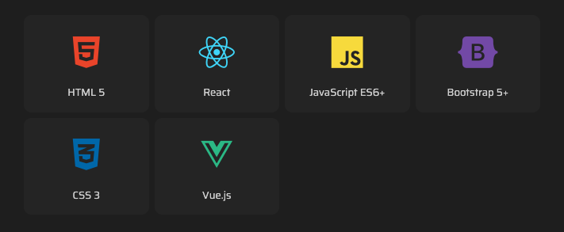

#  Tutorial 13 – ArticleStack

## Preview



The `ArticleStack` component is used for displaying a tech stack in a grid format.

## Basic Working Example

Just copy and paste this into a section's `articles` array and see the magic happen:

```json
{
    "id": 1,
    "component": "ArticleStack",
    "locales": {
        "en": {"title": "{{Backend}} Stack"}
    },
    "settings": {
        "order_items_by": "id",
        "order_items_sort": "asc"
    },
    "items": [
        {
            "id": 1,
            "img": "",
            "faIcon": "fa-brands fa-node-js",
            "faIconColors": {"bg": "", "bgLight": "", "fill": "#339933", "fillLight": ""},
            "date": {"year": null, "month": null},
            "locales": {
                "en": {
                    "title": "Node.js"
                }
            }
        },

        {
            "id": 2,
            "img": "",
            "faIcon": "fa-brands fa-java",
            "faIconColors": {"bg": "", "bgLight": "", "fill": "#0295c2", "fillLight": "#007396"},
            "date": {"year": null, "month": null},
            "locales": {
                "en": {
                    "title": "Java"
                }
            }
        },

        {
            "id": 3,
            "img": "",
            "faIcon": "fa-solid fa-gem",
            "faIconColors": {"bg": "", "bgLight": "", "fill": "#CC0000", "fillLight": ""},
            "date": {"year": null, "month": null},
            "locales": {
                "en": {
                    "title": "Ruby on Rails"
                }
            }
        }
    ]
}
```

### Required Settings

| Property                                 | Type    | Description                                                                           |
|------------------------------------------|---------|---------------------------------------------------------------------------------------|
| `order_items_by`                         | STRING  | Defines the item key that will be used for ordering items. Default: `"id"`.           |
| `order_items_sort`                       | STRING  | Defines the direction of the order. Use `"asc"` (ascending) or `"desc"` (descending). |

## Item Structure

Each item of the `ArticleStack` article represents a single technology.

### Empty Item Model
```json
{
    "id": 0,
    "img": "",
    "faIcon": "",
    "faIconColors": {"bg": "", "bgLight": "", "fill": "", "fillLight": ""},
    "date": {"year": null, "month": null},
    "locales": {
        "en": {
            "title": ""
        }
    }
}
```

### ⚡ Item Static Fields

| Property           | Type               | Required? | Description                                                                                                                                                                                      |
|--------------------|--------------------|-----------|--------------------------------------------------------------------------------------------------------------------------------------------------------------------------------------------------|
| `id`               | NUMBER             | REQUIRED  | A unique ID for the item within the article.                                                                                                                                                     |
| `img`              | STRING (URL)       | OPTIONAL  | Path to the image shown in the avatar. Must be relative to `public/`. If not provided, the article falls back to the `faIcon`.                                                                   |
| `faIcon`           | STRING             | OPTIONAL  | A [Font Awesome](https://fontawesome.com/search?ic=free) icon used as a fallback if no image is specified (now supporting [PrimeIcons](https://www.primefaces.org/diamond/icons.xhtml) as well!) |
| `faIcon.bg`        | STRING (HEX COLOR) | OPTIONAL  | Custom background color for the `faIcon`. Defaults to the theme dark color.                                                                                                                      |
| `faIcon.bgLight`   | STRING (HEX COLOR) | OPTIONAL  | Custom background color for the `faIcon` in light themes. Defaults to theme dark color.                                                                                                          |
| `faIcon.fill`      | STRING (HEX COLOR) | OPTIONAL  | Custom `faIcon` fill color for dark themes. Defaults to the current theme's text color.                                                                                                          |
| `faIcon.fillLight` | STRING (HEX COLOR) | OPTIONAL  | Custom `faIcon` fill color for light themes. Defaults to the current theme's text color.                                                                                                         |
| `date`             | OBJECT             | OPTIONAL  | A date that represents when you started using this technology — used for calculating your experience time. Must contain `year` and `month`.                                                      |

### 🌐 Item Locales Fields

| Property | Type   | Required?   | Description                 |
|----------|--------|-------------|-----------------------------|
| `title`  | STRING | REQUIRED    | The name of the technology. |

> **Note:** All fields in the locales object support the following custom formatting:
>- `{{Some text...}}` for highlighting a text.
>- `[[Some text...]]` for making a text bold.
>
> **Note 2:** Required and recommended fields must be present **at least** in the default language.

## Next Steps
Ready to keep going? Check out the next tutorial or revisit the previous one if you need a refresher:

⬅️ [Previous: ArticleTimeline](./TUTORIAL_12_ARTICLE_TIMELINE.md)
&nbsp;&nbsp;&nbsp;&nbsp;&nbsp;&nbsp;|&nbsp;&nbsp;&nbsp;&nbsp;&nbsp;&nbsp;
[Next: ArticlePortfolio](./TUTORIAL_14_ARTICLE_PORTFOLIO.md) ➡️ 
