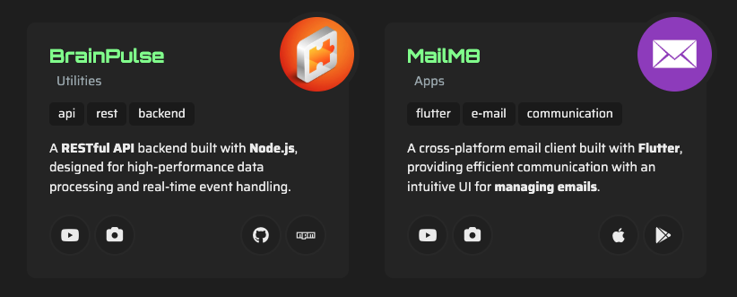

#  Tutorial 14 – ArticlePortfolio

## Preview



The `ArticlePortfolio` component is used for displaying a portfolio of items, such as projects, published apps, or any other collection of items that you want to showcase.

## Basic Working Example

Just copy and paste this into a section's `articles` array and see the magic happen:

```json
{
    "id": 1,
    "component": "ArticlePortfolio",
    "locales": {
        "en": {
            "title": ""
        }
    },
    "settings": {
        "order_items_by": "id",
        "order_items_sort": "asc"
    },
    "items": [
        {
            "id": 1,
            "img": "",
            "faIcon": "fa-solid fa-laptop-code",
            "faIconColors": {"bg": "blue", "fill": "white"},
            "preview": {
                "links": [
                    {"href": "https://github.com", "tooltipString": "open_website", "faIcon": "fa-brands fa-github"},
                    {"href": "https://npm.com", "tooltipString": "open_website", "faIcon": "fa-brands fa-npm"}
                ],
                "screenshots": [
                ],
                "screenshotsAspectRatio": "16:9",
                "youtubeVideo": "https://www.youtube.com/watch?v=32XsfeIX_rM"
            },
            "locales": {
                "en": {
                    "title": "Dope Project",
                    "text": "This is a dope project developed by me. Feel free to check it out and tell me what you think!",
                    "tags": ["Dope", "Project", "Java"]
                }
            }
        }
    ]
}
```

### Required Settings

| Property                                 | Type    | Description                                                                           |
|------------------------------------------|---------|---------------------------------------------------------------------------------------|
| `order_items_by`                         | STRING  | Defines the item key that will be used for ordering items. Default: `"id"`.           |
| `order_items_sort`                       | STRING  | Defines the direction of the order. Use `"asc"` (ascending) or `"desc"` (descending). |

**Note:** If you'd like your portfolio to include a category filter like the one in the live example, check out [Tutorial #20 - Categorizing Article Items](./TUTORIAL_20_CATEGORIZING_ARTICLE_ITEMS.md) for step-by-step instructions on how to implement it.

## Item Structure

Each item of `ArticlePortfolio` represents a project.

### Empty Item Model
```json
{
    "id": 0,
    "img": "",
    "faIcon": "",
    "faIconColors": {"bg": "", "bgLight": "", "fill": "", "fillLight": ""},
    "preview": {
        "links": [
            {"href": "", "tooltipString": "", "faIcon": ""}
        ],
        "screenshots": [
        ],
        "screenshotsAspectRatio": "16:9",
        "youtubeVideo": ""
    },
    "locales": {
        "en": {
            "title": "",
            "text": "",
            "tags": []
        }
    }
}
```

### ⚡ Item Static Fields

| Property               | Type               | Required?     | Description                                                                                                                                                                                      |
|------------------------|--------------------|---------------|--------------------------------------------------------------------------------------------------------------------------------------------------------------------------------------------------|
| `id`                   | NUMBER             | REQUIRED      | A unique ID for the item within the article.                                                                                                                                                     |
| `img`                  | STRING (URL)       | RECOMMENDED   | Path to the image shown in the avatar. Must be relative to `public/`. If not provided, the article falls back to the `faIcon`.                                                                   |
| `faIcon`               | STRING             | OPTIONAL      | A [Font Awesome](https://fontawesome.com/search?ic=free) icon used as a fallback if no image is specified (now supporting [PrimeIcons](https://www.primefaces.org/diamond/icons.xhtml) as well!) |
| `faIcon.bg`            | STRING (HEX COLOR) | OPTIONAL      | Custom background color for the `faIcon`. Defaults to the theme dark color.                                                                                                                      |
| `faIcon.bgLight`       | STRING (HEX COLOR) | OPTIONAL      | Custom background color for the `faIcon` in light themes. Defaults to theme dark color.                                                                                                          |
| `faIcon.fill`          | STRING (HEX COLOR) | OPTIONAL      | Custom `faIcon` fill color for dark themes. Defaults to the current theme's text color.                                                                                                          |
| `faIcon.fillLight`     | STRING (HEX COLOR) | OPTIONAL      | Custom `faIcon` fill color for light themes. Defaults to the current theme's text color.                                                                                                         |

### 👁️ Item Preview Fields

| Property                   | Type           | Required?   | Description                                                                                                                                                       |
|----------------------------|----------------|-------------|-------------------------------------------------------------------------------------------------------------------------------------------------------------------|
| `links`                    | OBJECT[]       | RECOMMENDED | A list of links related to the item. Each link will be displayed as a button. All links can contain a `href` field, a `tooltipString` field and a `faIcon` field. |
| `screenshots`              | STRING (URL)[] | OPTIONAL    | A list of urls of screenshots related to the item. Each url must be relative to the `public/` folder (e.g. `images/pictures/screenshot-0.png`)                    |
| `screenshotsAspectRatio`   | STRING         | OPTIONAL    | The aspect ratio of the screenshots. The supported values are `16:9` (landscape), `1:1` (square) and `9:16` (portrait).                                           |
| `youtubeVideo`             | STRING (URL)   | OPTIONAL    | A YouTube video URL to be displayed in the item preview.                                                                                                          |

### 🌐 Item Locales Fields

| Property  | Type     | Required?    | Description                                                                |
|-----------|----------|--------------|----------------------------------------------------------------------------|
| `title`   | STRING   | RECOMMENDED  | The title of the item.                                                     |
| `text`    | STRING   | RECOMMENDED  | The description of the item.                                               |
| `tags`    | STRING[] | OPTIONAL     | A list of tags related to the item. Each tag will be displayed as a badge. |

> **Note:** All fields in the locales object support the following custom formatting:
>- `{{Some text...}}` for highlighting a text.
>- `[[Some text...]]` for making a text bold.
>
> **Note 2:** Required and recommended fields must be present **at least** in the default language.

## Next Steps
Ready to keep going? Check out the next tutorial or revisit the previous one if you need a refresher:

⬅️ [Previous: ArticleStack](./TUTORIAL_13_ARTICLE_STACK.md)
&nbsp;&nbsp;&nbsp;&nbsp;&nbsp;&nbsp;|&nbsp;&nbsp;&nbsp;&nbsp;&nbsp;&nbsp;
[Next: ArticleTestimonials](./TUTORIAL_15_ARTICLE_TESTIMONIALS.md) ➡️ 
