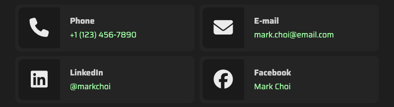

#  Tutorial 16 – ArticleInfoList

## Preview



The `ArticleInfoList` component is used to display a list of information items, such as contact options or interests.

## Basic Working Example

Just copy and paste this into a section's `articles` array and see the magic happen:

```json
{
    "id": 1,
    "component": "ArticleInfoList",
    "settings": {
        "order_items_by": "id",
        "order_items_sort": "asc"
    },
    "locales": {
        "en": {"title": "My info {{list}}"}
    },
    "items": [
        {
            "id": 1,
            "faIcon": "fa-solid fa-laptop-code",
            "faIconColors": {"bg": "", "bgLight": "", "fill": "", "fillLight": ""},
            "label": null,
            "link": {"href": null, "tooltipString": null},
            "locales": {
                "en": {
                    "title": "{{First}} item",
                    "text": "This is an example of an item with a description."
                }
            }
        },
        {
            "id": 2,
            "faIcon": "fa-solid fa-video",
            "faIconColors": {"bg": "", "bgLight": "", "fill": "", "fillLight": ""},
            "label": "Google",
            "link": {"href": "https://google.com", "tooltipString": "open_website"},
            "locales": {
                "en": {
                    "title": "{{Second}} item",
                    "text": ""
                }
            }
        }
    ]
}
```

### Required Settings

| Property                                 | Type    | Description                                                                           |
|------------------------------------------|---------|---------------------------------------------------------------------------------------|
| `order_items_by`                         | STRING  | Defines the item key that will be used for ordering items. Default: `"id"`.           |
| `order_items_sort`                       | STRING  | Defines the direction of the order. Use `"asc"` (ascending) or `"desc"` (descending). |

## Item Structure

Each item of the `ArticleInfoList` article represents a piece of information that can include a title, an icon, a description and a link.

### Empty Item Model
```json
{
    "id": 0,
    "faIcon": "",
    "faIconColors": {"bg": "", "bgLight": "", "fill": "", "fillLight": ""},
    "label": "",
    "link": {"href": "", "tooltipString": ""},
    "locales": {
        "en": {
            "title": "",
            "text": ""
        }
    }
}
```

### ⚡ Item Static Fields

| Property                | Type               | Required?   | Description                                                                                                                                          |
|-------------------------|--------------------|-------------|------------------------------------------------------------------------------------------------------------------------------------------------------|
| `id`                    | NUMBER             | REQUIRED    | A unique ID for the item within the article.                                                                                                         |
| `faIcon`                | STRING             | RECOMMENDED | A [Font Awesome](https://fontawesome.com/search?ic=free) icon (now supporting [PrimeIcons](https://www.primefaces.org/diamond/icons.xhtml) as well!) |
| `faIcon.bg`             | STRING (HEX COLOR) | OPTIONAL    | Custom background color for the `faIcon`. Defaults to the theme dark color.                                                                          |
| `faIcon.bgLight`        | STRING (HEX COLOR) | OPTIONAL    | Custom background color for the `faIcon` in light themes. Defaults to theme dark color.                                                              |
| `faIcon.fill`           | STRING (HEX COLOR) | OPTIONAL    | Custom `faIcon` fill color for dark themes. Defaults to the current theme's text color.                                                              |
| `faIcon.fillLight`      | STRING (HEX COLOR) | OPTIONAL    | Custom `faIcon` fill color for light themes. Defaults to the current theme's text color.                                                             |
| `label`                 | STRING             | OPTIONAL    | The label for the item link (if provided).                                                                                                           | 
| `link.href`             | STRING             | OPTIONAL    | The destination URL if the item is clickable.                                                                                                        |
| `link.tooltipString`    | STRING             | OPTIONAL    | A key from `strings.json` to show as a tooltip when hovering the item.                                                                               |

### 🌐 Item Locales Fields

| Property | Type   | Required? | Description                  |
|----------|--------|-----------|------------------------------|
| `title`  | STRING | REQUIRED  | The title of the item.       |
| `text`   | STRING | OPTIONAL  | The description of the item. |

> **Note:** All fields in the locales object support the following custom formatting:
>- `{{Some text...}}` for highlighting a text.
>- `[[Some text...]]` for making a text bold.
>
> **Note 2:** Required and recommended fields must be present **at least** in the default language.

## Next Steps
Ready to keep going? Check out the next tutorial or revisit the previous one if you need a refresher:

⬅️ [Previous: ArticleTestimonials](./TUTORIAL_15_ARTICLE_TESTIMONIALS.md)
&nbsp;&nbsp;&nbsp;&nbsp;&nbsp;&nbsp;|&nbsp;&nbsp;&nbsp;&nbsp;&nbsp;&nbsp;
[Next: ArticleFacts](./TUTORIAL_17_ARTICLE_FACTS.md) ➡️ 
