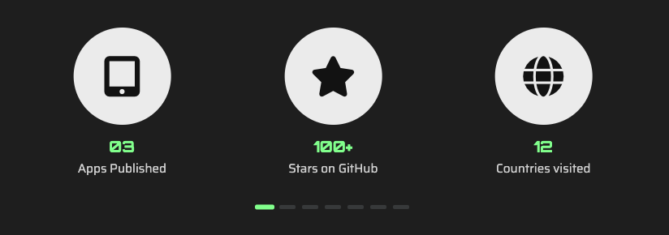

#  Tutorial 17 – ArticleFacts

## Preview



The `ArticleFacts` component is used for displaying fun facts, statistics, or any other numerical data in a visually appealing way. 

## Basic Working Example

Just copy and paste this into a section's `articles` array and see the magic happen:

```json
{
    "id": 1,
    "component": "ArticleFacts",
    "locales": {},
    "settings": {
        "order_items_by": "id",
        "order_items_sort": "asc"
    },
    "items": [
        {
            "id": 1,
            "img": "",
            "faIcon": "fa-solid fa-tablet-screen-button",
            "faIconColors": {"bg": "", "fill": ""},
            "locales": {
                "en": {
                    "title": "03",
                    "text": "Apps Published"
                }
            }
        },

        {
            "id": 2,
            "img": "",
            "faIcon": "fa-solid fa-star",
            "faIconColors": {"bg": "", "fill": ""},
            "locales": {
                "en": {
                    "title": "100+",
                    "text": "Stars on GitHub"
                }
            }
        }
    ]
}
```

### Required Settings

| Property                                 | Type    | Description                                                                           |
|------------------------------------------|---------|---------------------------------------------------------------------------------------|
| `order_items_by`                         | STRING  | Defines the item key that will be used for ordering items. Default: `"id"`.           |
| `order_items_sort`                       | STRING  | Defines the direction of the order. Use `"asc"` (ascending) or `"desc"` (descending). |

## Item Structure

Each item of the `ArticleFacts` article represents a fact or statistic, which can be a number, percentage, or any other numerical data that you want to showcase.

### Empty Item Model
```json
{
    "id": 0,
    "img": "",
    "faIcon": "",
    "faIconColors": {"bg": "", "bgLight": "", "fill": "", "fillLight": ""},
    "locales": {
        "en": {
            "title": "",
            "text": ""
        }
    }
}
```

### ⚡ Item Static Fields

| Property               | Type               | Required?   | Description                                                                                                                                                                                      |
|------------------------|--------------------|-------------|--------------------------------------------------------------------------------------------------------------------------------------------------------------------------------------------------|
| `id`                   | NUMBER             | REQUIRED    | A unique ID for the item within the article.                                                                                                                                                     |
| `img`                  | STRING (URL)       | OPTIONAL    | Path to the image shown in the avatar. Must be relative to `public/`. If not provided, the article falls back to the `faIcon`.                                                                   |
| `faIcon`               | STRING             | RECOMMENDED | A [Font Awesome](https://fontawesome.com/search?ic=free) icon used as a fallback if no image is specified (now supporting [PrimeIcons](https://www.primefaces.org/diamond/icons.xhtml) as well!) |
| `faIcon.bg`            | STRING (HEX COLOR) | OPTIONAL    | Custom background color for the `faIcon`. Defaults to the theme dark color.                                                                                                                      |
| `faIcon.bgLight`       | STRING (HEX COLOR) | OPTIONAL    | Custom background color for the `faIcon` in light themes. Defaults to theme dark color.                                                                                                          |
| `faIcon.fill`          | STRING (HEX COLOR) | OPTIONAL    | Custom `faIcon` fill color for dark themes. Defaults to the current theme's text color.                                                                                                          |
| `faIcon.fillLight`     | STRING (HEX COLOR) | OPTIONAL    | Custom `faIcon` fill color for light themes. Defaults to the current theme's text color.                                                                                                         |

### 🌐 Item Locales Fields

| Property | Type   | Required?   | Description                                          |
|----------|--------|-------------|------------------------------------------------------|
| `title`  | STRING | REQUIRED    | The title of the item (e.g. "100+")                  |
| `text`   | STRING | OPTIONAL    | The description of the item (e.g. "Stars on GitHub") |


> **Note:** All fields in the locales object support the following custom formatting:
>- `{{Some text...}}` for highlighting a text.
>- `[[Some text...]]` for making a text bold.
>
> **Note 2:** Required and recommended fields must be present **at least** in the default language.

## Next Steps
Ready to keep going? Check out the next tutorial or revisit the previous one if you need a refresher:

⬅️ [Previous: ArticleInfoList](./TUTORIAL_16_ARTICLE_INFO_LIST.md)
&nbsp;&nbsp;&nbsp;&nbsp;&nbsp;&nbsp;|&nbsp;&nbsp;&nbsp;&nbsp;&nbsp;&nbsp;
[Next: ArticleThreads](./TUTORIAL_18_ARTICLE_THREADS.md) ➡️ 
