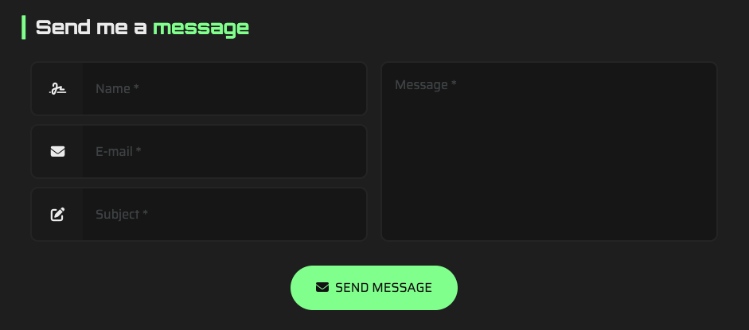

#  Tutorial 19 – ArticleContactForm

## Preview



The `ArticleContactForm` component is used for displaying a contact form that allows users to send messages or inquiries directly from the website. Unlike other articles, this one does not require any items to be defined. Instead, it relies on settings for configuration.

## EmailJS Integration

The contact form component integrates `EmailJS`. EmailJS is a free service that allows you to send emails using JavaScript - without the need for a backend.

To configure your EmailJS integration, follow these steps:

- Create a free EmailJS account (https://www.emailjs.com/)
- In your EmailJS account panel, create an email service, which configures the provider that will send the emails (e.g., a Gmail or iCloud account).
- Next, on your dashboard, create a new ``Contact Us`` email template.
- On the template edit page, set a subject like: ``My Portfolio - New message from {{name}}``
- Make sure the field ``To Email`` field on the right bar is set to the email address where you want to receive the messages.
- In the template body, you can click on ``Edit Content``, then ``Code Editor``, and paste the following code snippet:

```html
<!DOCTYPE html>
<html>
<head>
    <meta charset="UTF-8">
    <title>New Contact Message</title>
    <style>
        body {
            font-family: Arial, sans-serif;
            color: #333;
            background-color: #f9f9f9;
            padding: 20px;
        }
        .container {
            background-color: #ffffff;
            padding: 20px;
            border-radius: 8px;
            max-width: 600px;
            margin: auto;
            box-shadow: 0 2px 4px rgba(0,0,0,0.1);
        }
        .heading {
            font-size: 20px;
            margin-bottom: 25px;
            color: #444;
        }
        .info {
            margin-bottom: 10px;
        }
        .label {
            font-weight: bold;
        }
        .message {
            white-space: pre-line;
            margin-top: 10px;
            padding: 0 15px 15px;
            background-color: #f1f1f1;
            border-left: 4px solid #269366;
            border-radius: 4px;
        }
    </style>
</head>
<body>
<div class="container">
    <div class="heading">New portfolio message! 📩 </div>
    <div class="info"><span class="label">Name:</span> {{name}}</div>
    <div class="info"><span class="label">Email:</span> {{email}}</div>
    <div class="info"><span class="label">Subject:</span> {{custom_subject}}</div>

    <div class="info"><span class="label">Message:</span></div>
    <div class="message">
        {{message}}
    </div>
</div>
</body>
</html>
```

- Make sure you don't change the variable names in the template (`name`, `email`, `custom_subject`, `message`), as they are used by the component to serialize the email parameters.
- Now you're all set to configure your `ArticleContactForm` component!

## Basic Working Example

Copy and paste this into a section's `articles` array and replace the `YOUR_EMAIL_JS_(...)` placeholders with your own credentials:

```json
{
    "id": 1,
    "component": "ArticleContactForm",
    "settings": {
        "email_js_public_key": "YOUR_EMAIL_JS_PUBLIC_KEY",
        "email_js_service_id": "YOUR_EMAIL_JS_PUBLIC_SERVICE_ID",
        "email_js_template_id": "YOUR_EMAIL_JS_TEMPLATE_ID"
    },
    "locales": {
        "en": {
            "contact_thank_you_title": "{{Thanks}} for the contact!",
            "contact_thank_you_body": "Your message has been received, and I'll be reaching out to you soon. I appreciate your time and look forward to connecting with you!",
            "contact_thank_you_footer": "The reply will be sent to your email address: {{$email}}",
            "title": "Send me a {{message}}"
        }
    },
    "items": null
}
```

### Required Settings

| Property                | Type    | Description                                                                         |
|-------------------------|---------|-------------------------------------------------------------------------------------|
| `email_js_public_key`   | STRING  | Your EmailJS public key. It can be found in the `Account` tab on the EmailJS panel. |
| `email_js_service_id`   | STRING  | The ID of the email service you created in EmailJS.                                 |
| `email_js_template_id`  | STRING  | The ID of the email template you created in EmailJS.                                |

### Required Locales

| Property                        | Type    | Description                                                                                                |
|---------------------------------|---------|------------------------------------------------------------------------------------------------------------|
| `contact_thank_you_title`       | STRING  | The title displayed after the form is successfully submitted.                                              |
| `contact_thank_you_body`        | STRING  | The body text displayed after the form is successfully submitted.                                          |
| `contact_thank_you_footer`      | STRING  | The footer text displayed after the form is successfully submitted, which includes the parameter `$email`. |
| `title`                         | STRING  | The title of the contact form.                                                                             |

> **Note:** All fields in the locales object support the following custom formatting:
>- `{{Some text...}}` for highlighting a text.
>- `[[Some text...]]` for making a text bold.
>
> **Note 2:** All fields are required and must be present **at least** in the default language.

## Next Steps
Ready to keep going? Check out the next tutorial or revisit the previous one if you need a refresher:

⬅️ [Previous: ArticleThreads](./TUTORIAL_18_ARTICLE_THREADS.md)
&nbsp;&nbsp;&nbsp;&nbsp;&nbsp;&nbsp;|&nbsp;&nbsp;&nbsp;&nbsp;&nbsp;&nbsp;
[Next: Categorizing Article Items](./TUTORIAL_20_CATEGORIZING_ARTICLE_ITEMS.md) ➡️ 
