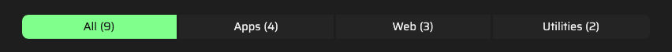

#  Tutorial 20 – Categorizing Article Items

You can organize article items into categories, allowing users to easily filter them — just like in the live demo portfolio, which separates items into "Apps", "Utilities", and "Web".



## Creating In-Article Categories

Here's an example configuration of an article with a category filter:

```json
{
    "id": 1,
    "component": "ArticlePortfolio",
    "locales": {
        "en": {
            "category_all": "All",
            "category_apps": "Apps",
            "category_web": "Web",
            "category_utilities": "Utilities",
            "title": "My amazing {{portfolio!}}"
        }
    },
    "settings": {
        "categorize_by": ["category_apps", "category_web", "category_utilities"],
        "order_items_by": "id",
        "order_items_sort": "asc"
    },
    "items": [
        
    ]
}
```

Key points you might want to note:
- Each category label should be defined in the article `locales` object, using the pattern `category_{id}`.
- You can create as many categories as you need, but the `category_all` field is required to allow users to view all items at once.
- Add a `categorize_by` array in the `settings` object to list all available categories that should appear in the filter. No need to define the `category_all` category here, as it is automatically included.
- Once you enable categorization for an article, **every item in it must belong** to a valid category, or the app will display a warning.
- For the best layout, it's recommended to use no more than 3 custom categories, as the menu may overflow the screen on smaller devices if it has 5 or more buttons.

## Binding Article Items to Categories

To assign an item to a category, add a `categoryId` field under it:

```json
{
    "items": [
        {
            "id": 1,
            "categoryId": "category_apps",
            "locales": {}
        },
        {
            "id": 2,
            "categoryId": "category_web",
            "locales": {}
        }
    ]
}
```

Once set up, users will be able to filter your article items by category using the generated filter buttons.

## Next Steps
Ready to keep going? Check out the next tutorial or revisit the previous one if you need a refresher:

⬅️ [Previous: ArticleContactForm](./TUTORIAL_19_ARTICLE_CONTACT_FORM.md)
&nbsp;&nbsp;&nbsp;&nbsp;&nbsp;&nbsp;|&nbsp;&nbsp;&nbsp;&nbsp;&nbsp;&nbsp;
[Next: Deploying for Production](./TUTORIAL_21_DEPLOYING_FOR_PRODUCTION.md) ➡️ 
