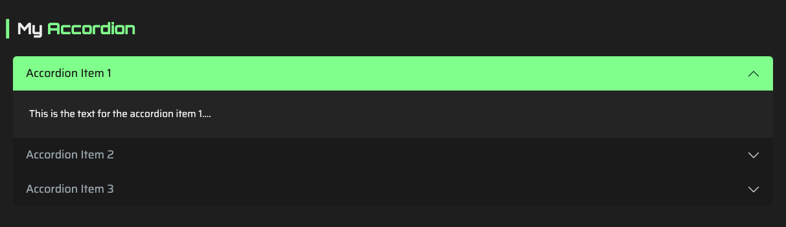

#  Tutorial 22 – Creating your own custom article

## 1. Introduction

If the default articles included in the portfolio don’t quite meet your needs, no worries — this template is pretty flexible and easy to extend. You can create your own custom components to display any type of content you like.

In this tutorial, we’ll walk through creating a new article type called `ArticleAccordion`. This component will display a list of items in an accordion layout, allowing users to expand and collapse each section to reveal its content.

For consistency, it's recommended to follow the `Article[Name]` naming convention when creating new articles — where `[Name]` is the name of your custom component.
This helps keep your codebase clean, predictable, and easy to maintain.

Let’s dive in!

## 2. Creating the new ArticleAccordion Component

The first step is to run the following command:

```bash
npm run resume:make:article ArticleAccordion
```

After running this command, you will find two files created in the `src/components/articles` folder:
- `ArticleAccordion.jsx` ➔ This is the main component file where we will define the structure and logic of our accordion article.
- `ArticleAccordion.scss` ➔ This file will contain the styles specific to our accordion article.

## 3. Implementing the components

Open the `ArticleAccordion.jsx` file. You will notice the file contains three components:
- `ArticleAccordion()` ➔ This is the main component that wraps the entire article.
- `ArticleAccordionItems()` ➔ This component is a container for the article's items.
- `ArticleAccordionItem()` ➔ This component represents each individual item.

Let's implement these components step by step.

### Importing Dependencies

First thing we're going to do is import Bootstrap's default accordion component on the `ArticleAccordion.jsx` file. This will allow us to leverage Bootstrap's built-in functionality for creating accordions:

```javascript
import {Accordion, AccordionItem} from "react-bootstrap"
```

### Implementing the first component: `ArticleAccordion`

This first component simply wraps the default Article component. We're not making any changes here — just preserving the default structure.

```jsx
function ArticleAccordion({ dataWrapper, id }) {
    const [selectedItemCategoryId, setSelectedItemCategoryId] = useState(null)

    return (
        <Article id={id}
                 type={Article.Types.SPACING_DEFAULT}
                 dataWrapper={dataWrapper}
                 className={`article-accordion`}
                 selectedItemCategoryId={selectedItemCategoryId}
                 setSelectedItemCategoryId={setSelectedItemCategoryId}>
            <ArticleAccordionItems dataWrapper={dataWrapper} 
                                   selectedItemCategoryId={selectedItemCategoryId}/>
        </Article>
    )
}
```

### Implementing the second component: `ArticleAccordionItems`

In this second component, we’ll create the Bootstrap accordion and wrap the items inside it. We'll also grab the first item from the `filteredItems` array and use its ID to set the initially expanded accordion item.

```jsx
function ArticleAccordionItems({ dataWrapper, selectedItemCategoryId }) {
    const filteredItems = dataWrapper.getOrderedItemsFilteredBy(selectedItemCategoryId)

    const defaultActiveKey = filteredItems.length ?
        filteredItems[0].uniqueId :
        null

    return (
        <Accordion className={`article-accordion-items`}
                   defaultActiveKey={defaultActiveKey}>
            {filteredItems.map((itemWrapper, key) => (
                <ArticleAccordionItem itemWrapper={itemWrapper} 
                                      key={key}/>
            ))}
        </Accordion>
    )
}
```

If you're working with more complex articles that include custom settings or preferences, you can access those fields through the `dataWrapper` component. This component is an instance of `src/hooks/models/ArticleDataWrapper.js` — a model that parses and manages the article's data. If you want to add custom settings fields, you should handle them inside the `_parseSettings()` method of this class.

### Implementing the third component: `ArticleAccordionItem`

Finally, we’ll implement the `ArticleAccordionItem` component. This component will render each item in the accordion, displaying its title and content.

```jsx
function ArticleAccordionItem({ itemWrapper }) {
    return (
        <AccordionItem className={`article-accordion-item`}
                       eventKey={itemWrapper.uniqueId}>
            <Accordion.Header>
                <div className={`eq-h6`}
                     dangerouslySetInnerHTML={{__html: itemWrapper.locales.title}}/>
            </Accordion.Header>
            <Accordion.Body>
                <div className={`text-3`}
                     dangerouslySetInnerHTML={{__html: itemWrapper.locales.text}}/>
            </Accordion.Body>
        </AccordionItem>
    );
}
```

Here, we're using the default locales properties `title` and `text`. If you want to add your own custom fields, you need to make sure they are defined and parsed in the `src/hooks/models/ArticleItemDataWrapper` model. 

If you want to add CSS styles to your component, you can also open `ArticleAccordion.scss` and add your custom styles there.

## 4. Using the ArticleAccordion Component

Now that we have implemented the `ArticleAccordion` component, we can use it in our portfolio. Open a section's JSON file and create an instance of the article:

```json
{
    "id": 1,
    "component": "ArticleAccordion",
    "locales": {
        "en": {"title": "My {{Accordion}}"}
    },
    "settings": {
        "order_items_by": "id",
        "order_items_sort": "asc"
    },
    "items": [
        {
            "id": 1,
            "locales": {
                "en": {
                    "title": "Accordion Item 1",
                    "text": "This is the text for the accordion [[first item]]...."
                }
            }
        },

        {
            "id": 2,
            "locales": {
                "en": {
                    "title": "Accordion Item 2",
                    "text": "This is the text for the accordion [[second item]]...."
                }
            }
        },

        {
            "id": 3,
            "locales": {
                "en": {
                    "title": "Accordion Item 3",
                    "text": "This is the text for the accordion [[third item]]...."
                }
            }
        }
    ]
}
```

And this is the expected result:

